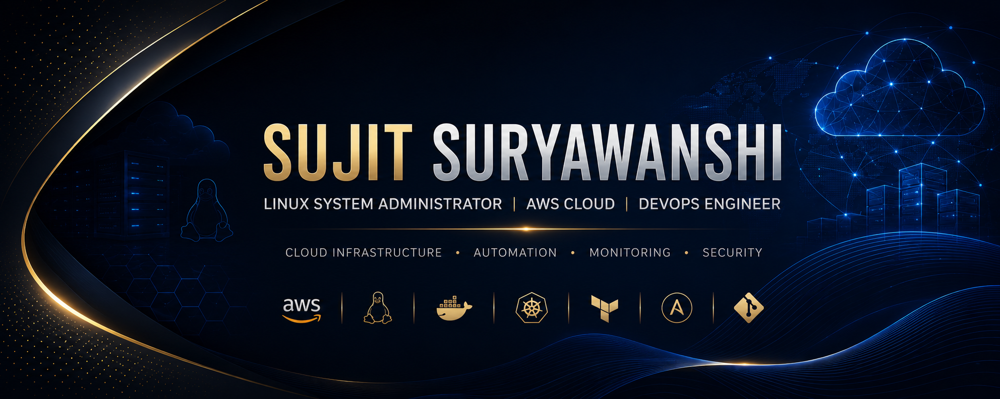

  

## 👋 About Me

I’m **Sujit Suryawanshi**, a **RHCSA Certified Linux System Administrator and AWS Cloud / DevOps Engineer** focused on building, managing, and troubleshooting reliable IT infrastructure.

My core interests include **Linux administration, AWS cloud infrastructure, server management, networking, automation, monitoring, and DevOps practices**. I enjoy turning repetitive infrastructure tasks into efficient and reliable automated workflows.

📍 **Location:** Pune, Maharashtra, India  
🎓 **Certification:** Red Hat Certified System Administrator (RHCSA)

### ☁️ Core Focus

- 🐧 **Linux & System Administration** — server management, troubleshooting, configuration, and maintenance
- ☁️ **AWS & Cloud Infrastructure** — cloud services, compute, networking, storage, and infrastructure management
- ⚙️ **Automation & DevOps** — scripting, Infrastructure as Code, CI/CD, containers, and deployment automation
- 📊 **Monitoring & Reliability** — system health, performance monitoring, troubleshooting, and operational improvements

### Currently Focused On

Building hands-on expertise in **AWS, Linux, Infrastructure as Code, DevOps automation, containerization, monitoring, and cloud infrastructure management**.

### Open To

Opportunities and collaborations related to **Linux Administration, Cloud Infrastructure, System Engineering, AWS, and DevOps**.

## 🚀 Featured Projects

### 🐧 Linux & AWS Infrastructure Automation Lab

A hands-on infrastructure project focused on **Linux system administration, AWS infrastructure, automation, monitoring, and troubleshooting**.

**Tech Stack:**  
`Linux` · `AWS EC2` · `VPC` · `Ansible` · `Bash` · `Docker` · `CloudWatch`

**Key Highlights:**

- 🐧 Linux user, permission, service, process, and package management
- ☁️ AWS EC2 infrastructure with networking and security configuration
- ⚙️ Ansible playbooks for configuration and operational automation
- 📜 Bash scripts for repetitive system administration tasks
- 🐳 Docker-based application environment
- 📊 CloudWatch-based monitoring and system health tracking
- 🔧 Linux and network troubleshooting

🔗 **[View Project →](YOUR-PROJECT-1-GITHUB-LINK)**

---

### 🎫 Event Management System

A **PHP and MySQL-based web application** for managing event bookings, customer interactions, payments, feedback, and administrative operations.

**Tech Stack:**  
`PHP` · `MySQL` · `Bootstrap` · `JavaScript` · `HTML/CSS` · `XAMPP`

**Key Highlights:**

- 🔐 User registration and authentication
- 📅 Event booking and booking management
- 👤 Customer dashboard and booking history
- 🛠️ Admin dashboard and event management
- 💳 Payment workflow and payment slip
- 💬 Feedback management
- 🗄️ MySQL database integration

🔗 **[View Project →](https://github.com/sujit5656/Event-Management-System-Sujit)**

---

## 🛠️ Tech Stack

**Cloud & Infra**

**Databases**

**Dev Tools**

 

## 📊 GitHub Stats

## 🏆 Trophies

  

## 📈 Contribution Graph

  

 

## 🔗 Connect With Me

 

